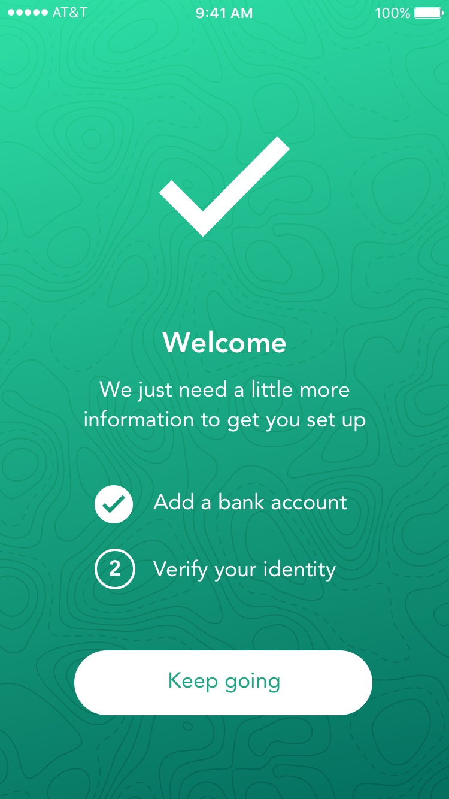
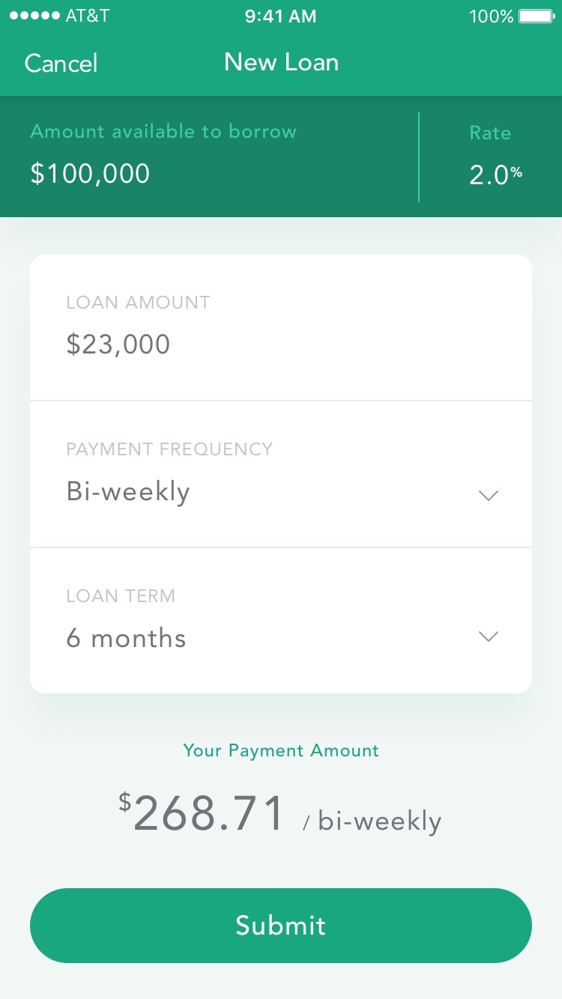
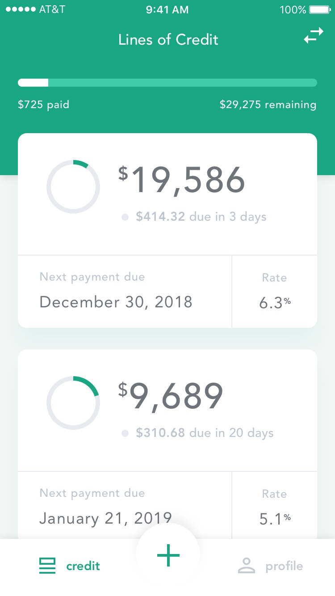
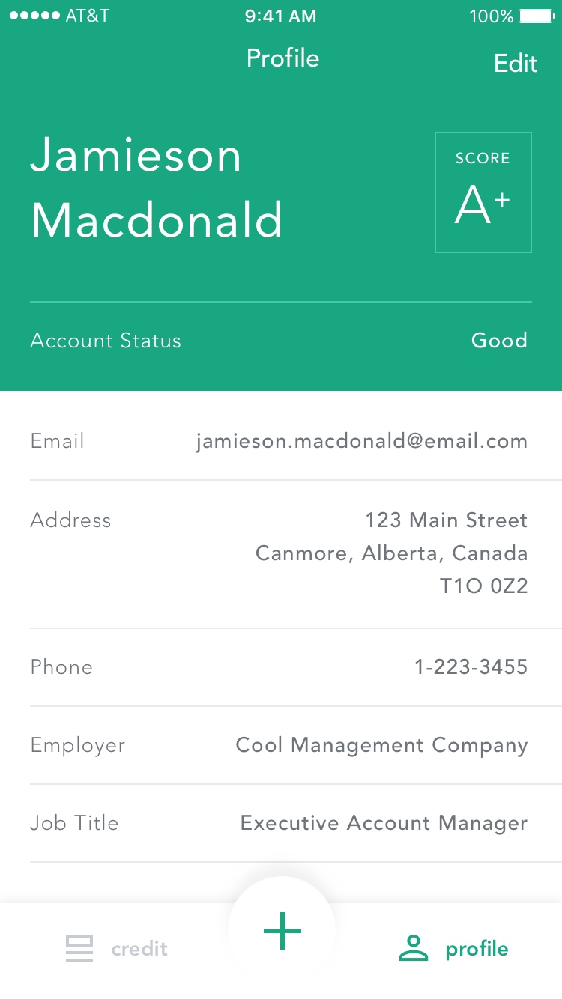

Compass Borrowers App
==================

## Description

An iOS app that is a peer-to-peer loan interface for borrowers to apply for loans and
monitor the status of their active applications and payment due dates.

Compass is a platform that brings ease of use and improvements to the loan industry
which have been largely untouched by automation. The goal is to make it easier for
everyday users to apply for personal loans.

## Screenshots

 

 

## Getting Started

### Prerequisites

Download and install [XCode](https://developer.apple.com/xcode/) from the app store

### Running Locally

Import the cloned project into XCode

Build and run on an iOS emulator

## Built With

* [NVActivityIndicatorView](https://cocoapods.org/pods/NVActivityIndicatorView) - Loading Animations
* [HTTPStatusCodes](https://cocoapods.org/pods/HTTPStatusCodes) - HTTP Status Code Wrapper

## Authors

* **Jordan Tymburski** - [Portfolio](https://jordantymburski.com/)

## Acknowledgments

* **Sarah Chou** - [A very talented designer](https://sarahchou.com/)
